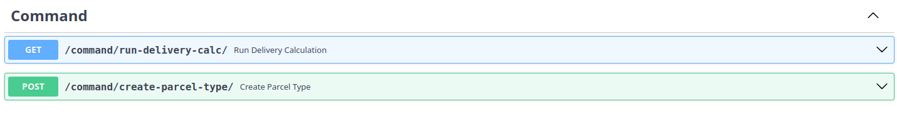

# Запуск
* Создать файлы окружения .env и docker.env и заполнить по примеру файлов .env_example и docker.env_example
* В консоли запустить команду docker compose up

* Далее переходим по ссылке:
http://127.0.0.1:8000/docs

Эндпоинты для добавления и получения посылок, а также получения всех типов посылок:

Эндпоинт для ручного запуска расчёта стоимости отправки и эндпоинт добавления типов посылок:
